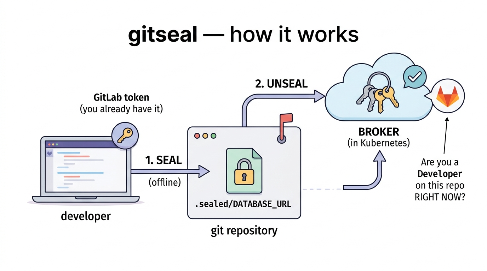
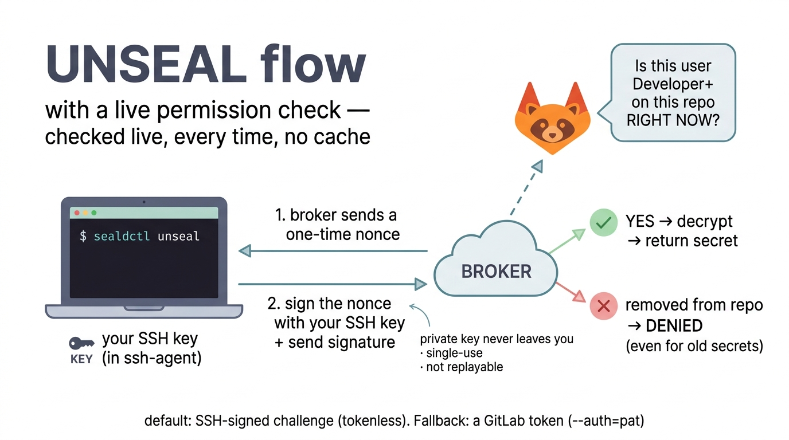
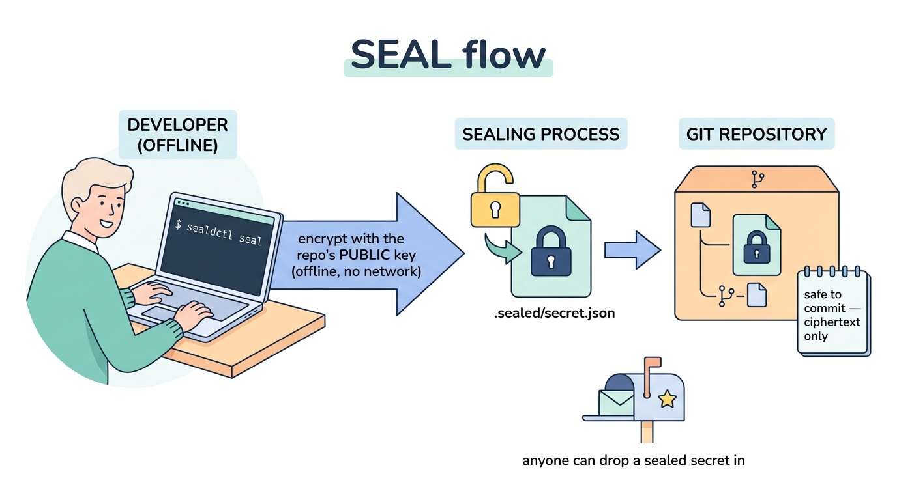
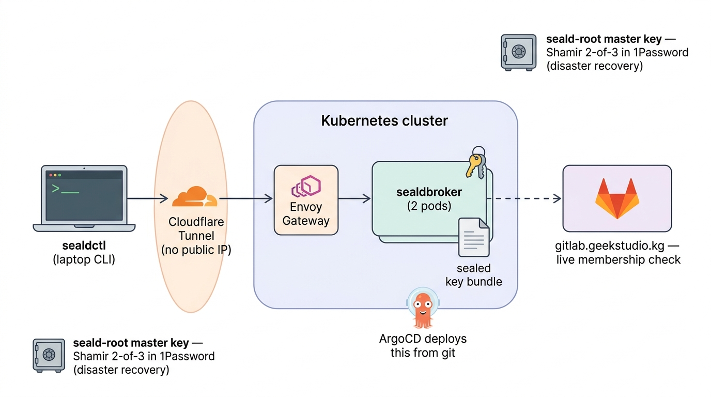

# gitseal

[](https://github.com/dawnbreather/gitseal/actions/workflows/ci.yml)
[](https://goreportcard.com/report/github.com/dawnbreather/gitseal)
[](LICENSE)

**Keep secrets (passwords, API keys, DB URLs) encrypted right inside your GitLab
repo — and let teammates decrypt them on their laptop using the GitLab login they
already have, but *only* while they're still on the project.**

Remove someone from the repo in GitLab → they instantly can't decrypt anymore.
No extra accounts, no extra passwords, no key files to hand out or revoke.



---

## Table of contents

- [The big idea in 60 seconds](#the-big-idea-in-60-seconds)
- [Which section is for me?](#which-section-is-for-me)
- **[👩‍💻 Developer guide](#-developer-guide)** — install the CLI, seal & unseal your secrets
  - [How it works (developer view)](#how-it-works-developer-view)
  - [Install](#install-developer)
  - [Setup](#setup-developer)
  - [Usage](#usage-developer)
- **[🛠️ DevOps guide](#-devops-guide)** — deploy & operate the broker, manage keys, onboard repos
  - [Architecture](#architecture-devops)
  - [Install / deploy the broker](#install--deploy-the-broker)
  - [Setup: bootstrap keys & onboard repos](#setup-bootstrap-keys--onboard-repos)
  - [Operations: offboarding, rotation, DR](#operations)
- [What it guarantees (and what it can't)](#what-it-guarantees-and-what-it-cant)
- [FAQ](#faq)

---

## The big idea in 60 seconds

You want to commit secrets into a repo (versioned next to the code) **without**
anyone who clones it being able to read them. The usual tools (SOPS, git-crypt,
GPG) encrypt to a fixed list of people and hand each person a key — and once
someone has the key, **you can never take it back**.

gitseal **never gives anyone a key.** A small in-cluster server (the *broker*)
holds the keys and decrypts *for* you, but only after asking GitLab "is this
person allowed, *right now*?" — every single time. There are two actions, and
they're deliberately different:

| | **Seal** (encrypt) | **Unseal** (decrypt) |
|---|---|---|
| Needs network? | ❌ No — fully offline | ✅ Yes — calls the broker |
| Needs permission? | ❌ Not to *run* it — but the change only **merges** if the author's GitLab access level clears the env's threshold (CI write-authz gate) | ✅ Yes — must be a current member at the required level, checked live |
| Uses which key? | the repo's **public** key (committed) | the repo's **private** key (only the broker has it) |
| Analogy | anyone can drop mail in the box, but the mailroom won't *accept* it into the archive unless you're cleared for that shelf | the post office checking your ID badge before handing you a package |

Running `seal` needs no permission (it's offline, to a public key) — but **landing**
the change is gated: the CI **write-authz gate** (`sealdctl verify --authz`) blocks the
merge unless the author's live GitLab access level meets the target environment's
required level. Reading (`unseal`) is gated the same way, live, on every call.

## Which section is for me?

- **You write code and just need your project's secrets** → [Developer guide](#-developer-guide).
- **You run the cluster / set up gitseal for a team** → [DevOps guide](#-devops-guide).

---

# 👩‍💻 Developer guide

Everything you need to seal and unseal secrets in a repo that's already been
onboarded by your DevOps team.

## How it works (developer view)

You only ever touch one tool: **`sealdctl`** on your laptop.

- **Seal** = encrypt a value to the repo's public key (committed in `.seald/`).
  Running it is offline and needs no permission — but the commit only **merges** if
  the CI write-authz gate clears you for that environment (see the DevOps guide). So
  "anyone can seal" means *produce the ciphertext locally*, not *land it unreviewed*.
- **Unseal** = ask the broker to decrypt. It checks, *live*, that your GitLab
  token belongs to an active human who is currently a member of this project at
  the required level. No caching — if you were removed from the repo, the next
  unseal is denied (even for a secret you read yesterday).



Your laptop never holds a decryption key — only your normal GitLab token. That's
what makes revocation instant.

## Install (developer)

`sealdctl` is a single static binary. You also need a GitLab token, which you
almost certainly already have via [`glab`](https://gitlab.com/gitlab-org/cli).

```bash
# 1. log in to GitLab once — this is the token sealdctl will use
glab auth login --hostname gitlab.example.com   # your GitLab host

# 2. install sealdctl from source (needs Go 1.26+)
go install github.com/dawnbreather/gitseal/cmd/sealdctl@latest

# 3. verify it can see your token + the broker
sealdctl doctor
```

`sealdctl doctor` prints `✓ GitLab PAT resolved`, your repo config, and the broker
URL. If it can't find a token: `export GITLAB_TOKEN=glpat-...`.

Optional env knobs (sensible defaults baked in):

| Var | Default | Meaning |
|---|---|---|
| `SEALD_BROKER` | `https://seald.example.com` | broker URL |
| `SEALD_HOST` | `gitlab.example.com` | GitLab host for token lookup |
| `GITLAB_TOKEN` | *(from glab)* | explicit token override |

## Setup (developer)

There's no per-developer setup beyond installing the CLI and `glab auth login`.
The repo you're working in must already contain a `.seald/repo.yaml` (your DevOps
team adds this once when [onboarding the repo](#setup-bootstrap-keys--onboard-repos)).
Check with:

```bash
cat .seald/repo.yaml      # shows project_id + the repo's public recipient
sealdctl doctor           # confirms your token + the repo config are found
```

If `.seald/repo.yaml` is missing, ask your DevOps team to onboard the repo.

## Usage (developer)

> **Which mode am I in?** Most repos here (demoapp, anything multi-environment) use
> **per-service, per-environment bundles** — `.sealed/<svc>.app.json`, driven by
> `--svc`/`--env`. That's the path below. A tiny single-environment repo can still
> use the flat `--name` / `--from --out` mode ([Legacy flat mode](#legacy-flat-mode));
> if you're unsure, `ls .sealed/` — `*.app.json` files mean per-service/per-env.

### Read a secret (`unseal` — broker-gated)

`unseal` calls the broker with your GitLab PAT; the broker re-checks your live
membership before decrypting, so revocation is instant.

```bash
sealdctl unseal --svc auth --env prod                     # all of auth's keys for prod
sealdctl unseal --svc auth --env prod --name POSTGRES_URL # one key
sealdctl unseal --svc auth --all-envs                     # every env (keys shown as ENV/KEY)

# output modes:
eval "$(sealdctl unseal --svc auth --env prod --export)"  # export into your shell
sealdctl unseal --svc auth --env prod -- ./my-app         # run my-app with them in its env
```

Each key is an independent live check — if you've been removed from the repo, every
one is denied; there's no partial leak.

### Write / change a secret (`seal` — offline)



`seal` is fully **offline** (no broker, no read needed): it encrypts to the repo's
**public** keys. You author plaintext in a base `.env` (never commit it — `*.env` is
gitignored), then seal:

```bash
# auth.env  (your DRAFT — do NOT commit):
#   POSTGRES_URL=postgres://...
#   API_KEY=...

sealdctl seal --svc auth --from auth.env          # fans out to ALL envs (prod/preprod/staging)
git add .sealed/auth.app.json && git commit -m "auth secrets" && git push
```

One paste → one ciphertext per env, each sealed to that env's cluster key (prod +
preprod → the prod cluster; staging → the staging cluster — crypto-isolated).

**Scope to one environment** (only the env(s) you have write-rights to — see the CI
write-authz gate in the DevOps guide):

```bash
sealdctl seal --svc auth --env staging --from auth.env   # touches ONLY the staging section
```

**A value that differs per env** — a small override file layered over the base:

```bash
sealdctl seal --svc auth --from auth.env --env-file prod=auth.prod.env
```

### Rotate an existing value (the one gotcha)

Because sealing is offline + non-deterministic, `seal`/`reseal` **cannot tell that
a present key's value changed** — it carries the old ciphertext verbatim (so
unrelated keys don't churn). To actually change a value you must make the key
absent first, then reseal. `reseal --rotate` does both in one step:

```bash
sealdctl reseal --svc auth --rotate API_KEY --from auth.env   # strip API_KEY, then reseal fresh
```

Adding a new key or removing one needs no ritual — the gotcha is **only** changing
an existing key's value.

### Access levels (why some secrets won't unseal for you)

A secret can require a GitLab access level: **30** Developer, **40** Maintainer,
**50** Owner. If you're a Developer and a secret is sealed at level 40, the broker
will deny you with `secret requires access level 40 (caller has 30)`. That's by
design — prod secrets are typically Maintainer-only. The level is sealed *inside*
each secret, so it can't be bypassed by editing the file.

> **Can I change a secret I can't read?** You can *seal* one (sealing is offline),
> but whether it **lands** is enforced twice: a CODEOWNERS review on `.sealed/`, and
> the **CI write-authz gate** (`verify --authz`) which denies a merge if your GitLab
> level is below the env's `env_min_level` (e.g. prod=40). You won't be able to
> *unseal* it back if it's above your level. See the DevOps guide.

### Legacy flat mode

A single-environment repo can use the original flat form (one file per secret, or a
plain bundle). Prefer the per-service/per-env mode above for anything multi-env.

```bash
sealdctl seal --name DATABASE_URL --value 'postgres://…'   # → .sealed/DATABASE_URL.json
echo -n 'postgres://…' | sealdctl seal --name DATABASE_URL --stdin
sealdctl unseal --name DATABASE_URL [--export | -- ./my-app]

sealdctl seal --from prod.env --out .sealed/prod.json [--merge [--prune]]   # a whole .env → one bundle
sealdctl unseal --bundle .sealed/prod.json --all [--format env|json] [--out .env]
```

---

# 🛠️ DevOps guide

Deploy and operate the broker, manage keys, onboard repos, handle offboarding.

## Architecture (DevOps)



- **`sealdctl`** (laptop CLI) — seals offline; for unseal it forwards the user's
  GitLab token + the ciphertext to the broker. Never holds a decryption key.
- **`sealdbroker`** (in-cluster) — stateless. Holds every repo's **private** key,
  each individually wrapped under its own KEK, so it only ever unwraps the one repo
  in the request. On every unseal it:
  1. validates the caller's PAT is live (`/personal_access_tokens/self`),
  2. resolves the caller as an active human (`/user`),
  3. reads the caller's **effective numeric access level** via
     `GET /projects/:id/members/all/:user_id` (⚠️ *not* `?min_access_level=` — that
 query param does **not** gate on GitLab 15.6.2-ee),
  4. decrypts and re-asserts the secret's embedded `project_id` + required level,
  5. returns plaintext **only if** `callerLevel >= requiredLevel`.
  No caching → revocation is just "remove them in GitLab."
- **GitLab** is the single source of truth for *both* identity (the token) and
  authorization (effective project membership). No second user directory.
- **Cloudflare Tunnel** exposes the broker with no public IP; **ArgoCD** deploys it
  from git; **bitnami Sealed Secrets** delivers the key bundle into the cluster
  encrypted.
- **`seald-root`** is the master key that can recover the whole system. It lives
  *only* as a Shamir 2-of-3 split in an out-of-band secret store (disaster recovery), never on a
  laptop or in the broker's hot path.

The crucial property — **no durable decryption key ever reaches a laptop** — is
what makes "remove from GitLab → can't decrypt" actually true.

Full design, threat model, and the adversarial reviews that shaped it are
documented in the project's design notes (covering both the broker and the
bundle format with its per-secret access level).

## Install / deploy the broker

The broker runs in the `example` cluster, deployed by **ArgoCD** from
`infra-repo/apps/seald/` — you don't `kubectl apply` it by hand. Layout:

```
infra-repo/apps/seald/
├── application.yaml              # ArgoCD Application (project: platform, wave 1)
└── manifests/
    ├── deployment.yaml           # 2 replicas, distroless, workers-only, digest-pinned
    ├── service.yaml              # ClusterIP :8080
    ├── httproute.yaml            # seald.example.com → broker (via Envoy Gateway)
    ├── seald-bundle.sealedsecret.yaml      # the per-repo private keys (encrypted)
    └── dockerhub-pull.sealedsecret.yaml    # pull secret for the private image
```

Tagged releases publish multi-arch images to GHCR automatically (see
`.github/workflows/release.yml`): `ghcr.io/dawnbreather/gitseal/sealdbroker`,
`.../gitseal-controller`, `.../seald-materialize`. To build one yourself:

```bash
docker build -t ghcr.io/dawnbreather/gitseal/sealdbroker:X.Y.Z .
docker push       ghcr.io/dawnbreather/gitseal/sealdbroker:X.Y.Z
# digest-pin the resulting @sha256:... in your Deployment manifest.
```

The broker is configured via env (`SEALD_GITLAB_URL`, `SEALD_BUNDLE_PATH`,
`SEALD_LISTEN`, `SEALD_REQUIRE_CF`) — all set in the Deployment.

## Setup: bootstrap keys & onboard repos

### First-time bootstrap (once per cluster)

```bash
# 1. generate the master key + escrow it (Shamir 2-of-3 into an out-of-band secret store)
sealdctl admin gen-root --shares 3 --threshold 2
#    → store each share as a SEPARATE secret-store item; never commit them.
#    → store the public recipient too.

# 2. build + push the broker image (see above), commit apps/seald/ to infra-repo.
#    ArgoCD deploys; the broker mounts the (sealed) key bundle.
```

### Onboard a new repo

**One command, ONE commit** (the target repo's `.seald/repo.yaml`). The private key
goes straight into the broker's own keystore Secret — never into git:

```bash
sealdctl admin onboard --project-id <GITLAB_PROJECT_ID> \
  --repo <path/to/target/repo> \
  --clusters-from <path/to/an/existing/.seald/repo.yaml> \  # copies the cluster + env registry
  --apply                                                    # patch the broker keystore Secret (kubectl)
```

What it does (offline mint; the only cluster contact is `--apply`):
1. mints a per-repo age keypair and produces a **v2 key file** — the RAW identity,
   `{version:v2, project_id, private_key_b64}` (no KEK; the KEK-wrapping never
   protected anything since the KEK shipped alongside it);
2. writes the correct `.seald/repo.yaml` (project_id + **public** recipient +
   `clusters`/`env_cluster`/`env_min_level` from `--clusters-from`) into the target
   repo — **the only git artifact**;
3. **self-verifies** the key resolves to exactly the recipient it committed;
4. **delivers the private key to the broker out-of-band**: `--apply` does a
   `kubectl patch` of the `seald-broker-keystore` Secret (ns `seald`), adding/
   replacing ONLY this repo's `<pid>.key.json` data key — never touching other
   repos' keys, never a git commit. (Air-gapped alt: `--emit-keyfile <path>` writes
   the v2 file for manual seeding.)
5. is **idempotent** — re-running is a no-op (reuses the existing key so its recipient
   never drifts). `--rotate` deliberately re-keys (WARN: orphans a repo's existing
   ciphertext — only for a repo whose secrets will be re-sealed).

So onboarding touches the target repo (one committed `repo.yaml`) + the broker's
out-of-band Secret. No `infra-repo` commit, no git-resident private key. Validate a
keystore offline anytime with `sealdctl verify-keys --dir <dir>`.

> Why the private key is not in git: it is only ever needed by the broker,
> so it lives in the broker's own Secret (like the materializer identity), seeded
> out-of-band. A leaked repo carries zero private key material, and there is no
> keystore SealedSecret to re-seal on every onboard. Escrow the broker keystore for
> DR (a repo whose secrets can't be re-sealed offline — e.g. one with live sealed
> values — must have its identity escrowed).

### Gate who can *change* prod secrets (merge controls)

Sealing is offline, so it **can't** be cryptographically restricted — a Developer
can locally produce a valid prod sealed value. Write-integrity is enforced at
**merge time**, in three layers:

1. **CI write-authz gate** — `sealdctl verify --authz` runs on every MR pipeline
   (merge blocked unless green). It diffs `.sealed/*` base→head, looks up the MR
   author's live GitLab level, and **denies** if they're below the changed env's
   `env_min_level` (e.g. prod=40) — the write-side mirror of the broker's read gate.
   Editing `.seald/repo.yaml` itself requires Owner (50). Inputs come from tamper-proof
   predefined CI variables, so the MR's own `.gitlab-ci.yml` can't spoof them.
   *Prerequisites:* a Protected `SEALD_AUTHZ_TOKEN` (read_api PAT) CI variable, and
   CODEOWNERS on `/.gitlab-ci.yml` so the job can't be edited away.
2. **CODEOWNERS** on `/.sealed/` and `/.seald/` → a maintainer must review any sealed
   change (a reviewer sees the blob changed, not its value).
3. **Protected branch** requiring Maintainer merge (+ code-owner approval on Premium).

## Operations

### Offboarding a developer (mandatory steps)

1. Remove them from the project (and any ancestor group that grants access).
   → their next unseal is denied immediately (no broker restart, no cache).
2. Revoke/expire their PAT, or block the GitLab user, for instant cutoff.
3. Revoke any access tokens they created (personal/project/group/impersonation).
4. **Rotate the secret *values*** of every repo they unsealed — already-revealed
   plaintext can't be clawed back. Get the exact list from the broker's Loki audit
   log: `{app="sealdbroker"} | json | username="<leaver>" decision="allow"`.

### Key rotation

- **Per-repo** (suspected key/blob exposure): `sealdctl admin add-repo` for a fresh
  key, re-seal current files, drop the old entry from the bundle. Git history keeps
  old ciphertext, so also rotate the secret values.
- **`seald-root`** (DR-anchor compromise): regenerate, re-wrap, re-Shamir-split,
  update the secret-store shares. Independent of the cluster key → no cluster-wide
  re-seal.

### Disaster recovery

The live keys are the `seald-bundle` SealedSecret. If lost, reconstruct `seald-root`
from any **2 of 3** secret-store shares, then re-issue per-repo keys.

> Full operator runbook (commands, troubleshooting): `infra-repo/.docs/runbook.md`
> → "gitseal".

### Deploying secrets to pods (NOT gitseal)

gitseal is for **humans**. A pod has no GitLab membership, so it can never unseal —
by design. To get a secret **into the cluster for a pod**, use **bitnami Sealed
Secrets** (already deployed): render a `SealedSecret` from the same source and let
ArgoCD deploy it. `sealdctl seal --emit k8s-sealedsecret` prints the exact
`kubeseal` command. A secret needed by both humans and pods is sealed twice — two
locks for two keyholders; intentional, not redundant.

---

## What it guarantees (and what it can't)

**Guarantees (enforced + tested, incl. live against a real non-admin token):**

- ✅ Only a **current member at the required level** can unseal, checked **live**
  on every request via `members/all/:user_id`.
- ✅ **Live revocation** — remove/demote in GitLab and the *next* unseal is denied.
  No cache, nothing to wait for.
- ✅ **Per-repo isolation** — a token good for repo A cannot decrypt repo B
  (enforced by the membership check *and* separate per-repo keys *and* the
  project_id embedded in the ciphertext).
- ✅ **Per-secret access levels** — Developer / Maintainer / Owner, sealed inside
  the ciphertext (can't be downgraded by editing the file).
- ✅ **Membership strictly required** — even a GitLab admin who isn't a project
  member gets nothing.
- ✅ **Fail-closed** — if GitLab is unreachable or anything is ambiguous, deny.

**Honest limits (no system can do these):**

- ⚠️ **Already-revealed plaintext can't be un-revealed.** Offboard ⇒ rotate the
  secret values they had (the audit log lists exactly which).
- ⚠️ A current member's **leaked token** works until that token or their membership
  is revoked. Use short-lived, `read_api`-scoped tokens.
- ⚠️ **Seal can't be access-gated** (it's offline). Write-integrity for prod
  secrets is GitLab merge controls, not cryptography.

---

## FAQ

**Do I need a new account or password?** No — you use the GitLab token you already
have (`glab`). That's the whole point.

**Can I seal a secret I'm not allowed to read?** Yes — sealing only needs the repo's
public key. You can contribute a secret you can't read back. Harmless and intentional.

**What if the broker is down?** You can't *unseal* (fail-closed). You can still
*seal* — that's offline.

**Is it safe to commit `.sealed/*.json`?** Yes. Ciphertext only the in-cluster
broker can open.

**What encryption?** [`age`](https://age-encryption.org) (X25519 + ChaCha20-Poly1305)
for secrets; NaCl secretbox to wrap the per-repo keys.

**How do I revoke someone?** Remove them in GitLab (instant) + rotate the secret
values they had access to. See [offboarding](#operations).

---

## Contributing

Issues and PRs welcome. Run `go test ./...` and `golangci-lint run` before submitting;
CI runs both plus `gofmt`, `go vet`, and image builds for all three components.

## License

[Apache License 2.0](LICENSE) © Slava Kim. See [NOTICE](NOTICE).
